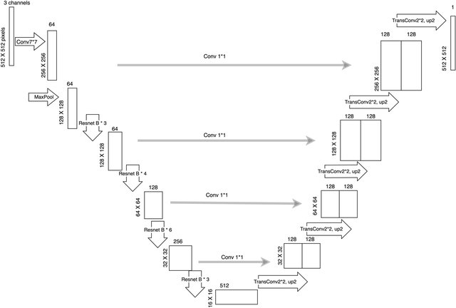

# UnetResnet for sUAV Image Segmentation (Pytorch)

### Context

A Kaggle competition was held at CentraleSupélec between teams of students; the goal was to provide the best algorithm possible to reach highest accuracy (computed with the _Dice coefficient_) while segmenting images taken from small UAVs.

We had toimplement and solve a remote sensing problem using recent deep learning techniques. In particular, the main objective of this challenge is to segment images acquired by a small UAV (sUAV) at the area on Houston, Texas. These images were acquired in order to assess the damages on residential and public properties after Hurricane Harvey. In total there are 25 categories of segments (e.g. roof, trees, pools etc.).

The task was to design and implement a deep learning model in order to perform the automatic segmentation of such images. The model could be trained using the train images which contain pixel-wise annotations. Using the trained model, a prediction on the test images had to be performed and submitted on the platform. Depending on the performance of the submitted file and the leaderboard you would be ranked accordingly using macro F1 score.

Following classes are present in the dataset.

1. Background
1. Property Roof
1. Secondary Structure
1. Swimming Pool
1. Vehicle
1. Grass
1. Trees / Shrubs
1. Solar Panels
1. Chimney
1. Street Light
1. Window
1. Satellite Antenna
1. Garbage Bins
1. Trampoline
1. Road/Highway
1. Under Construction / In Progress Status
1. Power Lines & Cables
1. Water Tank / Oil Tank
1. Parking Area - Commercial
1. Sports Complex / Arena
1. Industrial Site
1. Dense Vegetation / Forest
1. Water Body
1. Flooded
1. Boat

### Model

The model architecture used was based on the following architecture.

### Results

Model achieved **71% accuracy** on a train dataset of ~250 images, without using any pre-trained ResNet network inside the Unet network.

The "accuracy" was computed accordingly to the **_Sørensen-Dice Coefficient_**.
$$Dice = \frac{2 \mid A \cap B \mid}{\mid A \mid + \mid B \mid}$$
